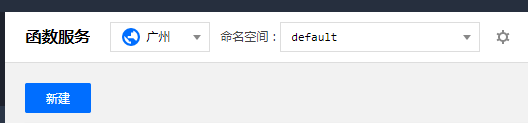
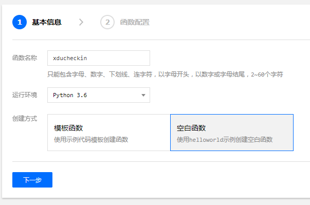
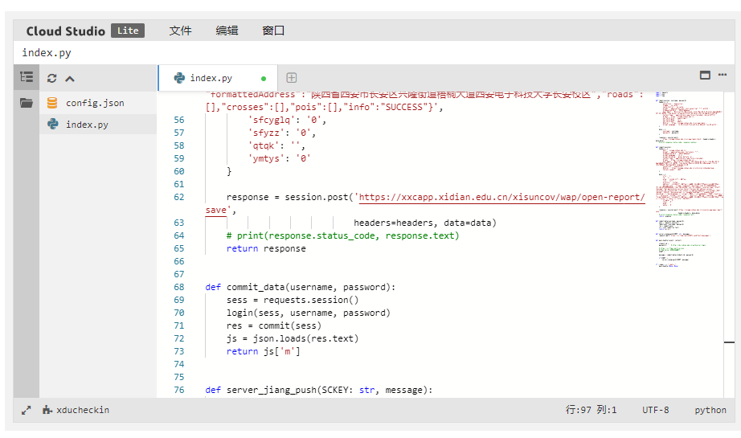
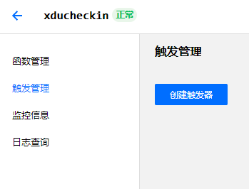
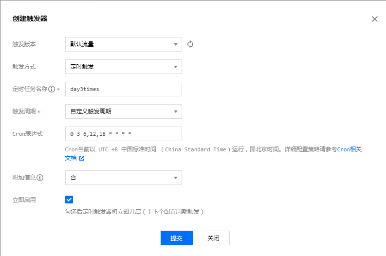

# xdu_ncov_check_in

> XDU 疫情通自动签到工具

## 免责声明

1. 如果发生了发烧等情况，请一定立刻马上上报！本软件不承担责任。

2. 签到失败，本软件不承担责任。

3. 其他所有情况，本软件不承担责任。

## 建议

如果起到了帮助，来个 star :D

## 部署

1. 下载 <https://github.com/117503445/xdu_ncov_check_in/blob/master/main.py>

2. 在最下面的 main_handler 填入信息，student_id 是学号，password 是西电一站式的密码。除此之外，强烈推荐填写 SCKEY 。这是基于 Server 酱的微信推送服务，只需要 1 分钟就可以完成注册，然后把 SCKEY 填入就可以收到每次签到情况的推送。<https://sc.ftqq.com/3.version>

3. 本地如果有 Python3 + requests 环境，可以先进行调试，观察输出是否正常，不调试也没大问题。

4. 每次运行脚本相当于触发一次签到动作，还需要做到定时运行脚本。建议使用腾讯云的函数计算。

### 函数计算

进入 <https://cloud.tencent.com/product/scf> 的管理控制台里的函数服务

新建



填写信息,名称随意



填入代码，测试，完成



触发管理-创建触发器



填入信息，名称随意。Cron 填入

```sh
0 2 6 * * * *
```

意为每天 6:02:00 定时触发

完成



后面自己再持续关注几次，看看会不会翻车。
